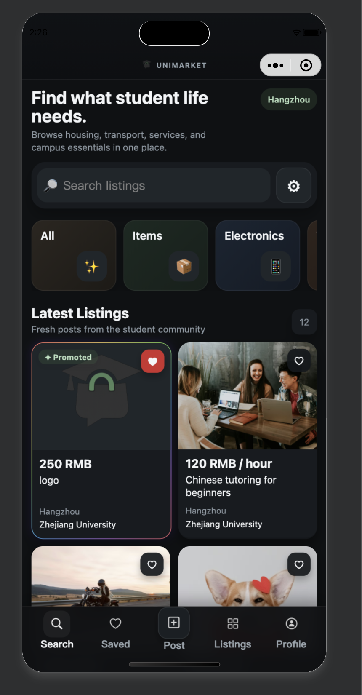
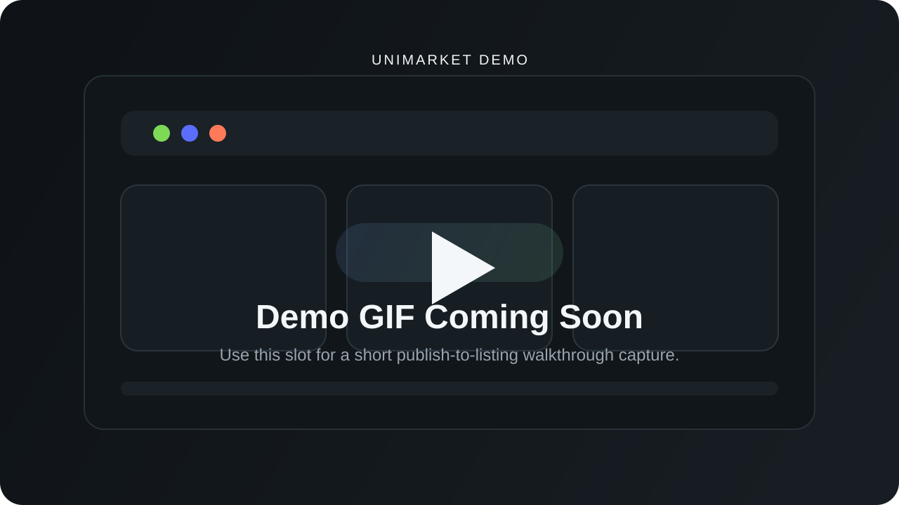

# UniMarket

<p align="center">
  
</p>

<p align="center">
  <strong>Local-first WeChat Mini Program marketplace for international students in Hangzhou.</strong>
</p>

<p align="center">
  UniMarket turns scattered chat-based buying and selling into a focused marketplace flow with discovery, trust signals, seller tooling, and moderation-ready controls.
</p>

<p align="center">
  <a href="https://github.com/theycallmedern/uni-market/actions/workflows/ci.yml"></a>
  <a href="./LICENSE"></a>
  
  
  
</p>

<p align="center">
  <code>WeChat Mini Program</code>
  <code>JavaScript</code>
  <code>WXML + WXSS</code>
  <code>Local storage MVP</code>
  <code>Dark mode</code>
  <code>Moderation tooling</code>
</p>

## ✨ Elevator Pitch

UniMarket is a marketplace shell designed for student communities that still coordinate heavily through WeChat.

Instead of forcing a backend-first marketplace too early, the project focuses on what matters first:

- faster discovery across housing, items, electronics, study resources, services, and transport
- cleaner posting and seller inventory management
- richer seller trust context through profiles, reviews, saves, and seller insights
- moderation flows that can be tested before server-side infrastructure exists

> [!IMPORTANT]
> This repository is intentionally local-first. Listings, saved items, profile state, admin access, and moderation state are stored on-device via `wx` storage APIs. It is an MVP shell, not a production backend.

## 🎥 Demo / Screenshots

### Live App Screen



### Demo GIF Placeholder



## 🚀 Features

- **Category-first discovery** for `Housing`, `Items`, `Electronics`, `Transport`, `Study`, `Services`, and `Other`
- **Fast marketplace browsing** with search, category pages, results filters, subcategory exploration, and promoted listings
- **Create + edit listing flow** with photo uploads, draft recovery, custom subcategories, price normalization, and condition selection
- **Seller inventory management** with open, edit, relist, mark-sold, delete, and archive flows
- **Seller profiles and reviews** with trust states, listing history, review summaries, and public/private profile views
- **Seller Pro surfaces** with insights, saved/view counts, listing performance, and premium-style profile presentation
- **Local moderation tooling** for listing reports, profile reports, hidden content states, and admin review actions
- **Dark theme support** across core screens including profile, settings, listing flows, search, categories, and results
- **Local-first saved flow** with cleanup mechanics for unavailable listings and blocked sellers
- **Shared UX infrastructure** for validation, storage, tab bar sync, feedback modals/toasts, and smoke-test coverage

## 🧱 Tech Stack

| Layer | Technology |
| --- | --- |
| App shell | WeChat Mini Program |
| UI | WXML + WXSS |
| Runtime | JavaScript |
| Persistence | `wx` local storage |
| Tooling | Node.js, shell scripts, WeChat DevTools |
| Quality gate | `scripts/check.sh`, smoke tests, syntax checks |
| CI | GitHub Actions |
| Planned backend direction | Cloudflare Workers + D1 + R2 |

## 📦 Installation

### Prerequisites

- WeChat Developer Tools
- Node.js 18+ recommended
- Git

### Clone the repository

```bash
git clone https://github.com/theycallmedern/uni-market.git
cd uni-market
```

### Install dependencies

```bash
npm install
```

### Run local quality checks

```bash
npm run check
```

`npm run check` currently runs:

- JavaScript syntax validation across `miniprogram/` and `scripts/`
- smoke tests for listings, saved state, category-to-results flow, and inventory mechanics

## ▶️ Usage

### Open in WeChat DevTools

Set the Mini Program root to:

```text
miniprogram/
```

### Typical developer workflow

```bash
# 1. install deps
npm install

# 2. run checks before opening DevTools
npm run check

# 3. open the repo in WeChat DevTools
# Mini Program root: miniprogram/
```

### Typical product flow

1. Open `Search` and browse by category or search query.
2. Open a listing and inspect photos, chips, seller card, and saved state.
3. Switch to `Post` to create or edit a listing.
4. Manage active and sold inventory in `Listings`.
5. Open `Profile` and `Settings` to manage public profile, theme, and admin access.

## 🧩 API / CLI

UniMarket does not expose a public API or end-user CLI in this MVP.

The developer-facing commands are intentionally small:

| Command | Purpose |
| --- | --- |
| `npm run check` | Run syntax checks + smoke tests |
| `bash scripts/check.sh` | Direct quality-gate script |
| `node scripts/smoke-test.js` | Run smoke scenarios explicitly |

### Example local listing shape

```js
{
  id: 1773928375491,
  title: "logo",
  price: "250 RMB",
  location: "Hangzhou",
  university: "Zhejiang University",
  categoryId: "other",
  subcategory: "Other items",
  condition: "New",
  isSold: false,
  isCustom: true,
  seller: {
    name: "demo_anna",
    wechat: "demo_anna",
    city: "Hangzhou"
  }
}
```

## 🗂 Project Structure

```text
uni-market/
├── .github/                    # CI workflows and repository automation
├── docs/
│   └── screenshots/            # README visual assets
├── miniprogram/
│   ├── assets/                 # brand, tab bar, and subcategory media
│   ├── components/             # shared UI components
│   ├── custom-tab-bar/         # custom navigation shell
│   ├── data/                   # local market dataset and config
│   ├── pages/
│   │   ├── index/              # home feed
│   │   ├── category/           # category browsing
│   │   ├── results/            # filtered results
│   │   ├── favorites/          # saved listings
│   │   ├── create/             # create/edit listing flow
│   │   ├── listing/            # listing detail
│   │   ├── messages/           # seller inventory + archive
│   │   ├── user-profile/       # public / own seller profile
│   │   ├── profile/            # account overview
│   │   ├── settings/           # theme + admin settings
│   │   └── moderation/         # moderation inbox
│   ├── utils/                  # storage, validation, stats, saved state
│   └── constants/              # centralized UI copy
├── scripts/
│   ├── check.sh                # local quality gate
│   └── smoke-test.js           # smoke scenarios
├── README.md
└── package.json
```

## ⚙️ Configuration

This MVP currently requires **no runtime `.env` file**.

### Current local configuration model

| Key | Where it lives | Purpose |
| --- | --- | --- |
| WeChat App ID | `project.config.json` / DevTools | Mini Program project binding |
| Local theme mode | `wx` storage | Light / dark theme persistence |
| User profile | `wx` storage | Public profile + seller defaults |
| Admin unlock state | `wx` storage | Local moderation access |
| Draft listing data | `wx` storage | Restore unfinished listing flow |

### Future environment variables

These are not active yet, but likely candidates once a backend exists:

```bash
CLOUDFLARE_ACCOUNT_ID=
CLOUDFLARE_D1_DATABASE_ID=
CLOUDFLARE_R2_BUCKET=
OPENAI_API_KEY=
```

## 🧪 Testing

Run the full local check suite:

```bash
npm run check
```

Or run the underlying pieces directly:

```bash
node --check miniprogram/pages/create/create.js
node scripts/smoke-test.js
bash scripts/check.sh
```

What is covered today:

- storage and validation paths
- category-to-results filtering
- create/edit listing logic
- favorites flow
- listing and profile-related state transitions

## 🚢 Deployment

Current deployment target is WeChat DevTools preview / upload flow.

### Local preview

```bash
# open project in WeChat DevTools
# use Preview or simulator inside the IDE
```

### Release path today

1. Run `npm run check`
2. Validate changed flows in WeChat DevTools
3. Upload via WeChat DevTools
4. Promote build through the Mini Program console

### Planned production direction

- backend-backed auth and moderation roles
- cloud image storage
- multi-device sync
- server-enforced reporting and visibility rules

## 🛣 Roadmap

- [x] Local marketplace MVP shell
- [x] Category and results browsing
- [x] Create/edit flow with drafts and validation
- [x] Saved listings and listing lifecycle
- [x] Seller profile, reviews, and insights
- [x] Local moderation inbox
- [x] Dark theme foundation across major surfaces
- [x] Shared smoke tests + CI
- [ ] Backend sync and authenticated roles
- [ ] Cloud media pipeline
- [ ] Real messaging and notifications
- [ ] Search ranking and recommendation tuning
- [ ] Campus-aware map and geo discovery

## 🤝 Contributing

Contributions are welcome, especially around product polish, Mini Program ergonomics, testing, and local-first architecture improvements.

Before opening a PR:

1. Run `npm run check`
2. Validate changed flows in WeChat DevTools
3. Update docs when user-facing behavior changes
4. Keep changes focused and avoid unrelated reformatting

See:

- [CONTRIBUTING.md](./CONTRIBUTING.md)
- [CODE_OF_CONDUCT.md](./CODE_OF_CONDUCT.md)
- [SECURITY.md](./SECURITY.md)

## 📄 License

This project is licensed under the [MIT License](./LICENSE).

## 👥 Authors / Credits

- **Misha Belakov** — product direction, concept, and implementation
- **Contributors** — UI, logic, docs, testing, and polish improvements

Additional credits:

- subcategory artwork and UI assets live in `miniprogram/assets/`
- listing demo imagery currently mixes bundled assets and remote placeholders used for MVP presentation
